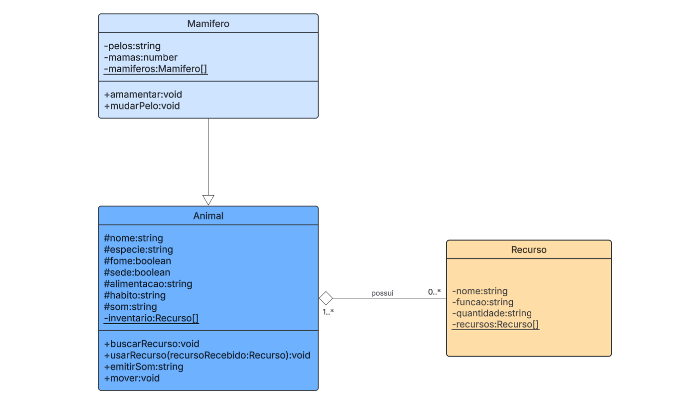

# Filme-Flow
### Objective
  - Definir juntos os atributos e métodos comuns a todos os animais (classe base).  
  - Classe base Animal com atributos como nome, especie, fome e sede e métodos como buscarRecurso(), emitirSom(), mover().  
  - Definir os atributos e métodos específicos para seu tipo de animal (classes derivadas).  
  - Classe derivada (Mamifero) que herda de Animal: **usar o conceito de super**.  
  - Aplicar polimorfismo para permitir que diferentes animais busquem recursos de maneiras distintas e com uma função interagir(animal1: Animal, animal2: Animal) que recebe dois objetos Animal como parâmetros.  
  
  - DESAFIO: Criar um ambiente de simulação com um loop que simule o tempo e a interação dos animais com os recursos(use a função interagir para simular os encontros dos animais).   

# CLASS DIAGRAMS
https://lucid.app/lucidchart/808efadd-39b8-4072-b8e6-2accc3300fe4/edit?viewport_loc=406%2C-261%2C1853%2C698%2CHWEp-vi-RSFO&invitationId=inv_c3dfec66-bab6-4105-be2c-1f5f82c835b8


# INSTRUCTIONS
## 1. Install all necessary packages at once:
```bash
npm install
```

## 2. Run it:
```bash
npx ts-node-dev ./main.ts
```
